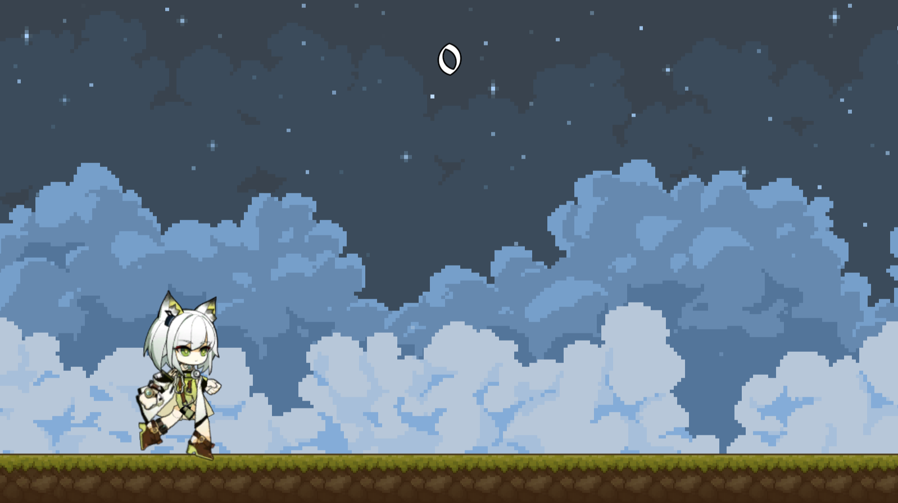

# 老猞猁GoGoGo!

  

水课上做的小游戏

我在挑战"老猞猁跳源石虫"比赛中获得了114514分, 击败了191.91810%的玩家! 快来试试吧!

> 空格/鼠标左键跳跃
>
> A-D键小幅度左右移动. 好好利用这个特性~

## 在线试玩

[Unity WebGL Player | Kaltsit Go Go Go ! (shthemw.github.io)](https://shthemw.github.io/Kaltsit-Go-Go-Go/)

